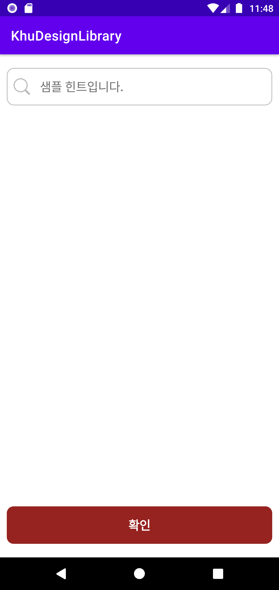

# khu-design-lib
경희대학교 국제캠퍼스의 Android 모바일 앱을 제작할 때 사용 가능한 디자인 라이브러리 입니다.

## How to use
<b>1. Android 프로젝트의 build.gradle에 Jitpack Repository를 추가하세요.</b>
```
allprojects{
  repositories{
    ...
    maven {url 'https://jitpack.io'}
  }
}
```
<b>2. build.gradle에서 라이브러리 사용을 위한 dependency를 설정하세요.</b>
```
implementation 'com.github.sunnnl:khu-design-lib:Tag'
```
<https://jitpack.io/#sunnnl/khu-design-lib>에서 최신 Tag를 확인할 수 있습니다.

## UI Component
### KhuButton
* text : 버튼의 텍스트를 작성합니다.
* <b>type</b> : (RED, BLUE, GREY) 중에서 하나를 선택할 수 있습니다.
### KhuEditText
* hint : Input 입력 시, 사용자에게 제공할 힌트를 작성합니다.
* setIcon : EditText 내부에 아이콘을 설정할 수 있습니다. 해당 속성을 사용하지 않으면 아이콘이 나타나지 않습니다.

## Sample App
app 디렉토리에서 샘플 애플리케이션의 소스를 확인할 수 있습니다.

